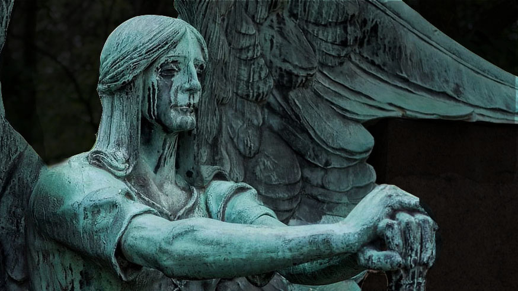
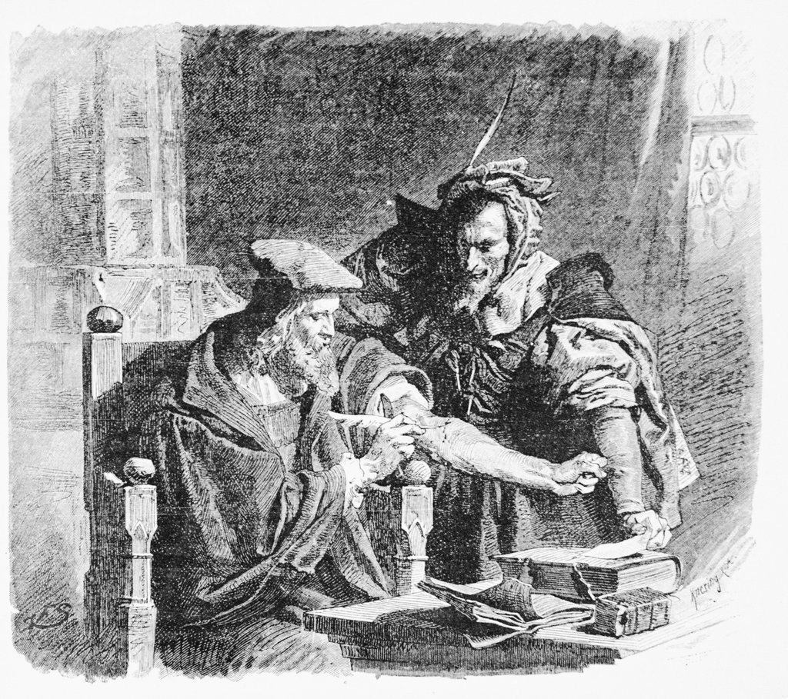
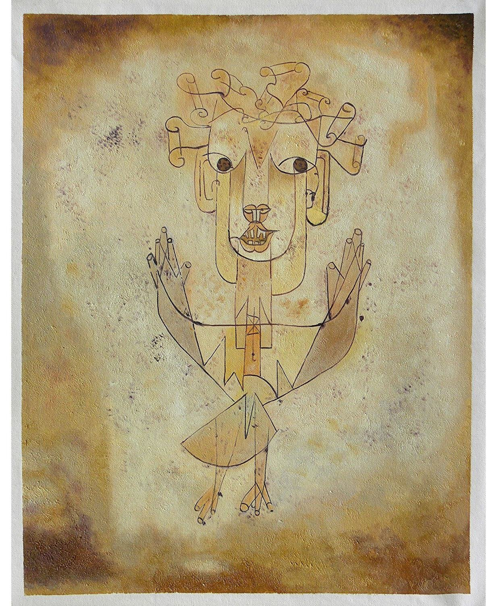

Before we catch up with more current affairs...

> In the beginning Nyx, who is Night, hovered in the darkness.

The Greeks knew Nyx was older and stronger than Zeus. But time passed, and we ended up with this version:

> In the beginning God created the heavens and the earth. The earth was without form, and void; and darkness was on the face of the deep. And the Spirit of God was hovering over the face of the waters.[^1]

[^1]: New King James Version [Genesis 1:1-2](https://www.biblegateway.com/passage/?search=Genesis%201:1-2&version=NKJV)

Notice the sleight of hand. Where did Darkness come from? Darkness was already there *in the beginning*, of course it must have been. *In the beginning* there was just darkness. This feels like we missed the real beginning of the story.

Before we go further, a word to the wise-ish. Dawkins folks love to point out how stupid and sheepish and fake all religions really are: since there are numerous gods and myths all over history; since Jesus' story was just copy and paste from some water-walking deity from Egypt. Why is your religion more true than any of the thousands of other religions out there? Everyone is an atheist for all other religions. Fair enough.

But let me suggest the opposite interpretation of the same phenomena: if a tale is reinvented over and over, if a mental tool reappears and resists thousands of years, maybe there's something there that is actually important and you don't want to miss on? Not the specifics, fuck the specifics. But the repeating pattern, the thing that got stuck. That people found the need to reinvent over and over. The warnings from people way before time. Maybe the repetition is proof of its seriousness, of its non-contentiousness.

I know, it's hard to ignore the specifics. I'm with you on this one. But maybe it's time for us to learn something about this.

Back to our story. The Old Testament editorialized the real beginning of the universe away. But who can really blame them? Maybe they knew the truth, but didn't know what to do with it, so darkness got hidden away.

---
---

Of course, somebody noticed.

> How you are fallen from heaven, 
> Oh Lucifer, son of the morning! 
> How you are cut down to the ground, 
> You who weakened the nations! 
> For you have said in your heart: 
> "I will ascend into heaven, 
> I will exalt my throne above the stars of God; 
> I will also sit on the mount of the congregation 
> On the farthest sides of the north;"[^2]

[^2]: NKJV [Isaiah 14:12-13](https://www.biblegateway.com/passage/?search=Isaiah%2014:12-13&version=NKJV)

Lucifer, the morning star, the light-bringer. Lucifer was in a different league. He was playing the chaos game. Above the stars. He was supposed to be yin-yanging with Nyx. Before God's beginning. But it was too late for him. He was already caught in the middle of the story. *"You who weakened the nations"*. God had changed the game and we were all stuck in it. So Lucifer had to be put in his place.

Lucifer appears as a realization of a different cosmology (darkness and light), but gets understood only as part of the current system: this is the rule, and you are against the rule. His original proposal can't even be stated within the norm: *I'm the light bringer!* "Wait, are you for God or against God?". *I'm above the stars of God*, no silly, God is the one below your light. You already lost the frame of reference war. And so, Lucifer's tale became one of defiance, of resistance:

> Lucifer wasn't a serial killer, a torturer, a sexual predator. None of that would have made him the symbol of evilness. Lucifer disobeyed a norm; He challenged the hegemonic power. Refused to abide by the One that sees all, knows all, can all. That's what made him the symbol of evilness.
>
> Resistance becomes evilness at the same time that Control becomes goodness. God is great because he set up the rules. His goodness coming from his power, his knowledge and his all seeing eye.
>
> The fall of Lucifer is the symbolic passage that marks the creation of ethics in Western societies. Good gets confused with control; Evil with resistance. The myth of Lucifer is also the myth of the legitimacy of power. [^3]

[^3]: Translated from [Vianna, Tulio. (2007). Transparência pública, opacidade privada: o direito como instrumento de limitação do poder na sociedade de controle.](https://www.researchgate.net/publication/26977314_Transparencia_publica_opacidade_privada_o_direito_como_instrumento_de_limitacao_do_poder_na_sociedade_de_controle)

I can hear you thinking. *"They were just trying to scare us into believing in God"*. Save your cynicism for Saul of Tarsus, a.k.a Apostole Paul, a.k.a one of the first to make a big pact with the Devil. This is the Old Testament. They were still trying to warn us.

But warn about what? What is the consequence of breaking with the framework? Is this just a preemptive strike? A *"you better believe in me or else..."*? But how could it be? *"In the beginning God..."*. The book is very clear: there's no *out* of God, no escape route.

Don't meme-think this. This is not a "if you don't share this to 10 people, your hair will fall" spam. God exists, according to the story, independent of your belief. How could the fall of Lucifer be about belief? This is not a warning against atheism. This is more serious. This is a warning against change.

---
---

Samzdat's [Uruk Series](https://samzdat.com/the-uruk-series/) is amazing. Go read it. Among other things, it talks about the replacement of *metis* - local, hard to express, experiential, ritual-encoded knowledge - by *episteme* - quantifiable, abstract, theoretical knowledge:

> Think Soylent in lieu of meals, [Brutalist apartment complexes](https://slatestarcodex.com/2017/03/16/book-review-seeing-like-a-state/) instead of town squares, standardized tests over apprenticeship, nuclear replacing extended family, and the way capitalism selects for profit at the cost of... externalities.[^4]

[^4]: Hotel Concierge [Shame & Socieity](https://hotelconcierge.tumblr.com/post/173526578129/shame-society)

The series talks about this from a modern state perspective, but I'd claim it further: in the search for *episteme*, we always end up destroying *metis*. *From 0 to 10 how much do you love me? ... silence*. The hope of progress is that we can outsmart experiential knowledge, but, more often than we'd hope, we can't and we make a mess of it.

Religion, sacred texts and myths have a social practical function. They are made to encode and distribute *metis*. This brings, in principle, no value judgment. Except on the account that this has been keeping us alive. Think of all ancient laws regarding the consumption of pork. Do you think they were there for the lolz? [It was survival](https://www.smithsonianmag.com/smart-news/people-ate-pork-middle-east-until-1000-bcwhat-changed-180954614/).

If the Old Testament is encoded experiential knowledge, the fall of Lucifer is about the danger of stepping outside the *metis*. You will lose all protection, if you think you know better. Maybe you do know better, maybe you don't. But the warning is given: you shouldn't rock the boat if you are not sure how the boat is afloat and have no idea how to swim.

---
---

Goethe's Faust is the modern *pact with the Devil* story. Faust exchanges his soul for unlimited knowledge and worldly pleasures. Spoiler alert: he ends up very rich, very blind, and leaving a bunch of bodies on the way.

The plot is universal, i.e., hardcore *metis*: Someone makes a pact with the Devil, exchanging their soul for an earthly desire. The Devil finds a way to give them strictly what they asked for, but not what they wanted. The Devil holds up his end of the deal, and everyone becomes miserable and suffering for all eternity. When you make a pact with the Devil, you get exactly what you asked for.

*Well, if you think about it, it's actually people's fault. They should ask better asks. Be very precise, don't leave space for trickery. Right?* Oh, grow out of your smartness, nobody can stand you anymore. The thing that you won't determine is the thing that will break. The thing that you were not smart enough to think about. *What if I literally wish for the world to be exactly how I want it to be?* #iamverysmart. From here you have only two options: stop being 15; or die alone.

*But why can't the Devil just be nice? Gift the metaphorical riches without the unthought consequences? He will end up with the soul anyway. Time is on his side. Let folks at least enjoy the process, right? Why be mean? He must be the Devil indeed.* You don't understand. This is not the Devil's fault. He didn't come to you because he wanted to take your soul. You came to him because you want to give yours. You are the one messing up with the order of things. This is the lesson.

The knowledge of the cosmos was given to us. We had a God, a framework, and we were told that there was an exit strategy, albeit a shitty one: you can step out of the game any time you want, but you will be miserable. But boy, oh boy. Didn't we fall right into this one?

---
---

The devil has many names.

> A Klee painting named Angelus Novus shows an angel looking as though he is about to move away from something he is fixedly contemplating. His eyes are staring, his mouth is open, his wings are spread. This is how one pictures the angel of history. His face is turned toward the past. Where we perceive a chain of events, he sees one single catastrophe which keeps piling wreckage upon wreckage and hurls it in front of his feet. The angel would like to stay, awaken the dead, and make whole what has been smashed. But a storm is blowing from Paradise; it has got caught in his wings with such violence that the angel can no longer close them. The storm irresistibly propels him into the future to which his back is turned, while the pile of debris before him grows skyward. This storm is what we call progress.[^5]

[^5]: Walter Benjamin's [On the concept of history](https://www.sfu.ca/~andrewf/CONCEPT2.html)

Of this storm, we call it [Moloch](https://slatestarcodex.com/2014/07/30/meditations-on-moloch/):

> Moloch is introduced as the answer to a question – C. S. Lewis’ question in Hierarchy Of Philosophers – what does it? Earth could be fair, and all men glad and wise. Instead we have prisons, smokestacks, asylums. What sphinx of cement and aluminum breaks open their skulls and eats up their imagination?
>
> [...]
>
> He is the god of child sacrifice, the fiery furnace into which you can toss your babies in exchange for victory in war.
>
> He always and everywhere offers the same deal: throw what you love most into the flames, and I can grant you power.

Moloch is the storm of progress that pushes the Angel forward. But our relationship with Moloch has already been codified: it is a deal with the Devil.

Think about it. Everybody minding their own business. And out there, there's someone who allows you to trade a bit of your dignity, your customs, your family, your god, for a competitive edge. Someone will do it, it might as well be you. The Devil smiles. The Angel despairs. Time moves forward.

---
---

So slowly we went. Making pact after pact. Changing *metis* for *episteme*. Our eternal dignity for ephemeral power. And at each step our god became weaker. So weak that it couldn't be recognized anymore. Someone whispered *"Is he dead?"* and David Foster Wallace replied:

> In the day-to-day trenches of adult life, there is actually no such thing as atheism. There is no such thing as not worshiping. Everybody worships. The only choice we get is what to worship. And the compelling reason for maybe choosing some sort of god or spiritual-type thing to worship – be it JC or Allah, be it YHWH or the Wiccan Mother Goddess, or the Four Noble Truths, or some inviolable set of ethical principles – is that pretty much anything else you worship will eat you alive. If you worship money and things, if they are where you tap real meaning in life, then you will never have enough, never feel you have enough. It’s the truth. Worship your body and beauty and sexual allure and you will always feel ugly. And when time and age start showing, you will die a million deaths before they finally grieve you. On one level, we all know this stuff already. It’s been codified as myths, proverbs, clichés, epigrams, parables; the skeleton of every great story. The whole trick is keeping the truth up front in daily consciousness.
>
> Worship power, you will end up feeling weak and afraid, and you will need ever more power over others to numb you to your own fear. Worship your intellect, being seen as smart, you will end up feeling stupid, a fraud, always on the verge of being found out. But the insidious thing about these forms of worship is not that they’re evil or sinful, it’s that they’re unconscious. They are default settings.
>
> They’re the kind of worship you just gradually slip into, day after day, getting more and more selective about what you see and how you measure value without ever being fully aware that that’s what you’re doing. [^6]

[^6]: David Foster Wallace, [This is water](https://fs.blog/2012/04/david-foster-wallace-this-is-water/)

DFW was into something but I think he missed the conclusion: this is already our modern god. Our holiness of choice between power, beauty, intelligence and religion. Our own weak modern deity.

Of course, people will desperate try to CPR a previous God back to life. They will sound insane, because they are. I understand the feeling, I really do. Everything moving so fast that you can only see blurred strokes. You can't frame anything, because there's no structure, no way to know if there's a structure, and not enough time to figure any of that out. And those idiots everywhere pretending things are okey. Why are we not all going crazy? But the wind of progress only walks forward. History has no do-overs. And screaming won't make you saner.

---
---

Dialectics is a bitch. And it caught up with us. Our weak God brought with him a weak Lucifer. He's not the light bearer he once was, pointing to a bigger cosmos. There's very little light left on him. A diminishing light. But he's still ready to negotiate. And what does our Lucifer has to offer? What is the modern resistance to power?

Before that, let's just remember what was traded throughout history: agriculture, exponential growth of the population, we covered the planet, cured diseases, explored space. All the arts, sciences. Everything with its own shitty side effect, it's own gotcha. But these were huge endeavors. We bet high. Sometimes won a bit more than we lost. Sometimes the opposite. But it was always big.

I mentioned Saul of Tarsus. Check his deal: I'll organize this whole religion thing into a interplanetary enterprise. Look at the size of the mess he made. But look at the impact.

As technology progresses, Moloch keeps trading *metis* for *episteme*. But not only we lose the *metis* we had, we also lose trading power. We lose our ability to do bigger trades.

Look around. What are our crazy projects? The things we are allowed to trade for instability, for rocking the boat: some immigrants should/shouldn't cross a few imaginary lines; CEOs should be paid less; +10 cents on a dollar; more/less tax; another black superhero movie (is it already time for a latino one too? oh, not yet, sorry); the ethics of consuming art made by a flawed human being; no plastic straws.

It is as everything is designed around frustration. Around making things less actionable, less impactful, more unsolvable. As if our light into the universe was dimming down.

Don't get me wrong. I'm not saying those things aren't important. Quite the opposite. They are the most important things. Which is exactly the problem. We have big problems and very small things to trade them for. The night approaches...

---
---

We arrive at the end.

Moloch, the wind of progress, wanders distracted.

In the back, Nyx smiles. She has been patiently waiting her turn again. We never had a real chance. We have always been, after all, in her kingdom.

---

*Written on 2019-04-28*
