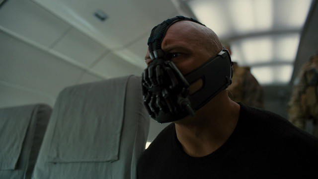
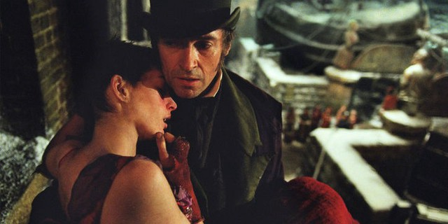

^["I’m pissed because they don’t respect my consumer rights!"]

In Dark Knight Rises, Bane locks all city police officers inside a cave, explodes a stadium, kidnaps a city and then this happens:

> INT. BOARDROOM, WAYNE ENTERPRISES  
BANE 
This meeting is called to order. 
Chair and President. I also need 
one ordinary member — Mr. Fox, 
would you care to nominate? 

Keep in mind this was not said ironically (as much as Bane’s emasculated Donald Duck voice allows it not to). Also keep in mind this is 2013 and everything we know about the world comes from watching 2D animations.

---

Fiction is a lie, but the biggest lies in fiction are things that we don’t perceive as fiction.

A straightforward case where this happens is with actors themselves. No matter how realistic a movie tries to be, every single movie happens in this fake world where the characters are not (famous) actors. Nobody stops Bruce Wayne to tell him he looks just like that guy from American Psycho. Nobody notices that Maid #3 is too hot to be a maid and that she could easily find a better job, maybe, I don’t know, being a 5 minutes character in a Hollywood movie.

*But what did you expect? You can’t make a movie without actors and this is just a stupid theoretical point, there are no implications*. Of course there are. They are letting you lie to yourself, and it’s gonna come back at you.

^["I would also empathize with a hobo that looked like her."]

You are learning that it’s possible to have a beautiful big apartment with a balcony in New York and buy all your kitchen stuff from Jamie Oliver while being a part-time waitress and spending most of your time jerking around with your hot Friends™. You are shown that there is such a thing as a sexy police officer that enjoys smooth jazz and reads Foucault at home while thinking that infinite zoom cameras are the only fiction at play in cop shows.

And you don’t understand why you are ass deep in debt. You just bought normal stuff: a computer, some clothes, a basic cable subscription. You have been told it was okay to pursue your life dream of an English major — minor in theater — and own an iPhone. It works for Penny, why doesn’t it work for you?

But here is the place where they take all you have and give nothing back. You think this is all a coincidence, a stupid theory from some internet chick with nothing better to do on a Saturday night.

You don’t see that there are no coincidences in the system. If it’s there, it’s there for a reason. If those stories teach you what to desire, they exist **to** teach you to desire. If movies are enabling you to cope with your life then they are also the reason why you are coping instead of living.

---

Another level of hidden fictional lies comes from things that are never said, but are implied by the story. Everything that is assumed to be true so the story makes sense is also part of the story.

*But how can the storyteller know what I’ll assume?* He doesn’t, but he assumes and then you assume the same thing. No story explains every single thing that it relies upon. Things are left out because anyone will be able to pick them up. And everyone does. They are not explicit there. But they are part of the story as much as the things that are actually there.

So I tell you about a story of a man who killed 26 people and you think “psychopath”, unless I put him on the cover and he is Bruce Willis, then you think “action hero”. It doesn’t matter how it goes. What matters is that we all reach the same conclusion, which means is not an accident.

So a story is both what is explicitly told and what must be assumed. But here’s the twist: if a story makes sense to you, you already believe everything that needs to be assumed for it to make sense. There’s a name for that, but I can’t find in myself what it is.

---

Back at Dark Knight, hipster Darth Vader takes over Gotham City and removes all big (i.e. national) government out of it by threatening to explode the city if the military intervenes. At this point he effectively owns the city.

Now he needs to activate some stupid machine that is owned by Wayne Enterprises. And he does what every sensible person with a Darth Vader mask would do: he goes to the company’s board meeting.

I’ll say it again, so it makes even less sense than the first time: the guy who controls the city goes to a board meeting and asks for it to activate the machine that can only be activated by at least 3 board members.

*Oh, it’s a minor script quirk, there was no need for a board meeting per se, only the members.* No! I’m spitting the crazy of it right at your face and you are still missing it by miles. Without a government, there is no board meeting because the company wouldn’t exist. And yet the writers still felt it was fine for Wayne Enterprises to be business as usual even when the city is completely controlled by a criminal.

Why does he need the board permission? Because the machine needs approval from 3 board members. But the machine doesn’t exist, it was made up by the writers. Why did they feel the need to include this completely pointless scene of a board meeting and “a machine that recognizes 3 board members”? While there are no cops in town, a football stadium just exploded, the military is at the bridge, why did everyone and you think it was okay to say “they were just having a board meeting and the machine will know the real board members. Makes sense”?

---

Let’s talk about why you made fun of Mitt Romney when he said corporations are people while still believing the same thing that he does. Ha! But he is a loser. Except that he still owns the corporations. And you don’t.

Think fast: what is the opposite of corporations? If you think it’s the government, welcome to the Matrix. Here is your red pill: the opposite of corporation is individual.

We are so used to hear the libertarian rhetoric about how companies and governments are in opposite sides of every possible issue, but they are on the same side. Want to guess who is on the other side?

The reason your boss can fire you is because there is a government that said it’s okay for him to fire you (your bosses also may need to follow some rules themselves, if you are in France). Because otherwise you would take your chair, hit that asshole right in its ugly face, and take over its position. Promotion Dothraki-style.

^["please direct your complains to HR"]

We don’t even know how to talk about companies without thinking of them as people anymore. Check the headlines: *“GM wants…”, “Facebook hopes…”*. And in the process we forget that they don’t exist, that they are just conventions, just illusions.

We believe so much that companies are living entities with god given rights (© Ayn Rand), and that government is its clear opposition that what Bane does doesn’t raise any flags. Nobody, not the film producers, writers, director, actors or the audience noticed anything wrong with that sequence’s logic. A sequence of events that can only makes sense in a society where companies are more real than everything else. Except that they aren’t. Which makes everyone dead wrong. Literally.

So next time you talk about government, companies, Mitt Romney or the new thing that The Daily Shows decided is important these days, remember: we are all libertarians now.
