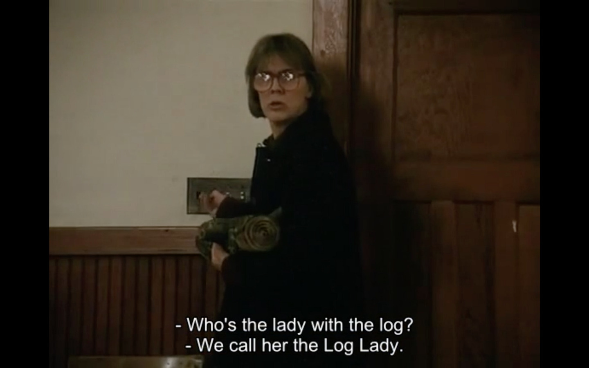
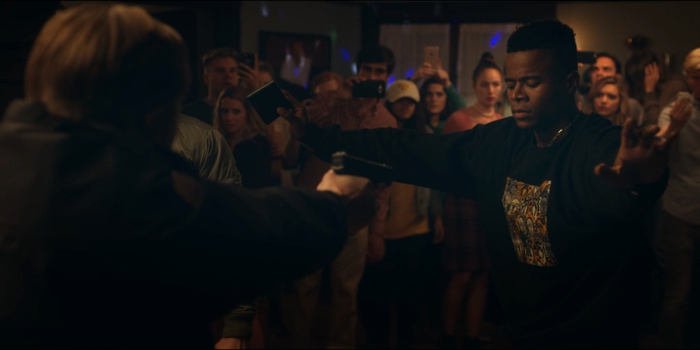

^[The Log Lady, Twin Peaks]

> Who’s the lady with the log? We call her the Log Lady.

We are off to a good start folks.

---

One of the cornerstones of psychoanalytical therapy, as stated by Freud in *Remembering, Repeating and Working-through*, suggests that a therapy subject will, while remembering past stories, repeat the same behavior that they presented on the original event. The hope is that this behavior repetition, in a controlled context (the therapy itself), will allow some self examination: *why are you screaming at the therapist? He clearly has no beef in it. Maybe you tend towards aggressiveness when someone questions you?*

But between having your vitality being sucked by your job and the latest Internet scandal, nobody ain’t got not time for therapy. So TV shows become our reality and memory. The way we interact with them, the repetition. And Facebook’s input box, our way to work through it.

Don’t believe me? It’s not an accident that both Facebook’s *“What’s on your mind?”* and Twitter’s *“What’s happening?”* sound like opening lines of crappy therapists. Everything has been accounted for, for a long time. And this is the new therapy. Except this is the cheap dude, and he learned somewhere that therapy is about agreeing with you. You are fucked. Everyone around you is fucked.

---

Our experiences come from TV. And I’m not saying that it confirms our biases (it does, but who cares when you have Facebook), I’m saying that our own understanding about the world is created by TV.

From David Simon’s Homicide, where he reports his work as a homicide journalist in Baltimore:

> Although the popular belief that many people fall down upon being shot is generally accurate, experts have determined that this occurs not for physiological reasons, but as a learned response. People who have been shot believe they are supposed to fall immediately to the ground, so they do. [...] There are countless cases in which people — often people whose mental processes are impaired by drugs or alcohol — are shot repeatedly, sustaining lethal wounds; yet despite the severity of their injuries, they continue to flee or resist for long periods of time. [...] If bullets truly had such power, the laws of physics would require that the shooter would also be knocked off his feet in similar fashion when he discharged the weapon.

This is your life now. I suggest that you think carefully about it.

Imagine you are a movie director and the script calls for a character getting shot. You want to visually identify that someone has been shot and express the power of the moment — a small hole on a shirt won’t cut it. Make the actor jump back, scream, fall to the ground. IMDB 7.3/10. Someone somewhere now has its own identity defined by this shit. Good job.

So people who have never seen someone getting shot now have an experience of it. They **know** what happens to a person getting shot. But then, we come full circle: since people now think they should fall down when they get shot, it becomes reality. Someone gets shot, and falls down as they have learned. Now even people who have seen someone getting shot know, first hand, that people fall down when they get shot. Except it’s all made up from dramaturgy.

That’s true for a physical reaction on an extreme event. We get shot and we begin acting, as we have been thought. But please, go on, tell me about your nuanced opinion on work-life balance. Our thoughts have been owned for a long time. To think is now a metaphor.

---

On Dear White People, the least self-aware show aired in recent history, we are offered the most embarrassing 10 minutes of TV since a constitutional law professor claimed that justice has been made through an assassination in foreign soil. Whatever is not dealt with is part of you now.

Reggie (woke, black) duos with white friend on a party trivia game. He kills it: *“This game is culturally biased against me and I’m still whooping y’all’s ass. I know y’all’s shit and my shit!”*. How do we know the game is culturally biased against black folks? The show refuses to gives us the questions, but here are the trivia answers presented without comment: 1789; Martin Van Buren; Osmosis; Ace of Spades; Lake Titicaca; Hyperhidrosis; The Milwaukee Brewers.

Later, they found themselves dancing. Reggie gets mad over trivia white friend singing along to *“God blessin’ all the trap niggas”*. The discussion gets heated. A healthy dose of classism goes unchallenged (*“I’m not some redneck, I’m not racist”*). Suddenly everyone is screaming. The police comes, pulls out a gun on Reggie. The party is over. Everybody is sad. Reggie is traumatized.

 ^[This is not about police violence against black folks. This is product placement.]

I could track every single absurdity about this scene, but we don’t have all night. Let’s just say the show is successfully reproducing the amazing conversation about race we’ve been having on Facebook as if that is real life. You think it is insightful writing? No. This is the garbage you’ve been bringing inside the house. You are a hoarder.

This allegorical cop draws a gun in a room with a hundred people. I get it, he is playing his part as racist trigger happy cop. There are many reasons why a cop should never pull out a gun while surrounded in a room. Top of the list is that you have 15 bullets and they are a hundred: you shoot, you are not getting out of this room alive. *“But he will take some people with him”*. Wait, is he a racist cop or a mental unstable teenager? You don’t even know the difference anymore. It’s all fuzzy, like a fairy tale...

But he is not the problem. Look behind it. There’s the trap and you’ve been caught. This scene is not about the cop. Is not even about Reggie. This scene is about the crowd. What are they doing? What are you supposed to do when you see injustice that could be stopped by your own actions? Pick up your phone and start recording it. You need to be ready for the real battle that will happen later on YouTube.

Why not a single student steps in between Reggie and the gun? Why everyone’s reaction is to stay passively spectating? I get it, no one wants to step in front of a gun voluntarily. Maybe we should adjust our rhetoric accordingly.

It’s a hundred to one. Surround the cop. What happens next? He fires a gun once, twice. Before the third time he is on the ground. Someone grabs his gun and shoves it inside his skull. How many times do you think this would need to happen before we all sit down and have a productive conversation about ending police brutality?

I can hear you thinking: I don't know, it sounds absurd, I wouldn't get in front of a gun. Let me get you in a secret: the gun is fake, it has no bullets. They are all actors. But the show is okey with teaching you that white people can't sing *nigga*, but god forbid you learn to fight back.

This is Social Justice Porn. This is for you to masturbate to your own ideas about how the world works, while being completely unaware of your role in the problem. Here, let them teach you how to behave, so we can be sure that nothing ever changes. It’s not the fall that kills you, is the sudden stop at the end.

---

You think I’m cherry-picking a show? Ha! We’ve been surrounded by woke media for a long time now. Check the feed: women beating to death a man - that they know is - wrongfully accused of rape as a metaphor for emancipation (so meta, so interesting); a fascist monarchic xenophobic society that enjoys street art (at least Breitbart and Saudi Arabia are on your side on this one). Everything gets a pass because it’s our turn now. No, it isn’t. It’s the same crap as always. You think the recent over centralization of media companies all of the sudden made them more diverse? Liberalism is going to kill us all.

They are not promoting change. This is not change. This is just the consequence of how shitty we’ve all become. You think watching this is therapeutic? You are damn right it is. But talk to any good therapist and they will tell you that most patients don’t go to therapy seeking real change. They are usually trying to become more effective neurotics: how can I not suffer about what people think of me while still deciding my life based on what people think of me? It works for people, fine. But good luck trying to change a society by keeping the same people pleased.

*“I’m glad they are finally depicting the world as it is”*. This is repetition. Aren’t you glad you finally figured everything out? Meanwhile, things are not getting better. Stop wanting to feel good about yourself. Your outrage is part of the problem. Your media consumption is part of the problem. Your rationalization is part of the problem. They are all symptoms.

Your behavior is already accounted for. It’s in the game. Somebody says something racist, everyone freaks out. Rush to the Internet! So glad they made a show about it. Nothing changes. Repeat.

Stop waiting for validation. What is this, 3rd grade? If it’s legal, if it’s not going down screaming, then it’s not changing anything. It has been coopted. We’ve known that for sixty years, where the fuck have y’all been that made you forget how mass media works?

So this is our choice now: either we are going to enjoy this feeling of being validated about how we think the world works or we are going to change it. And by it I mean ourselves. We can’t have both ways.

I guess they were right all along, porn has become a public health issue.

---

*Written on 2018-04-18*
